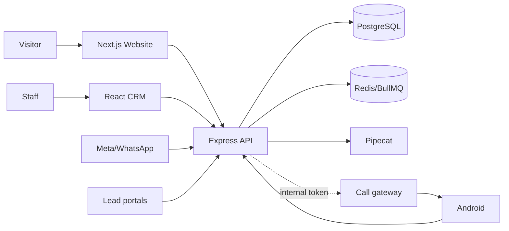
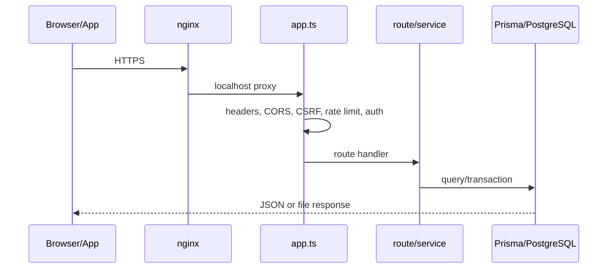
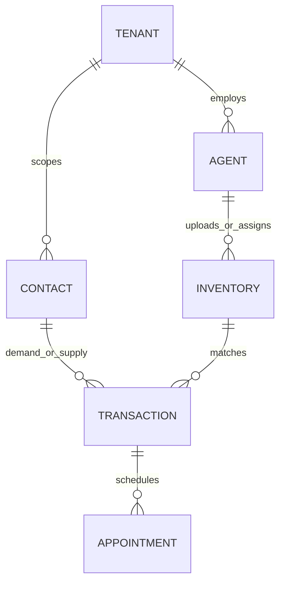
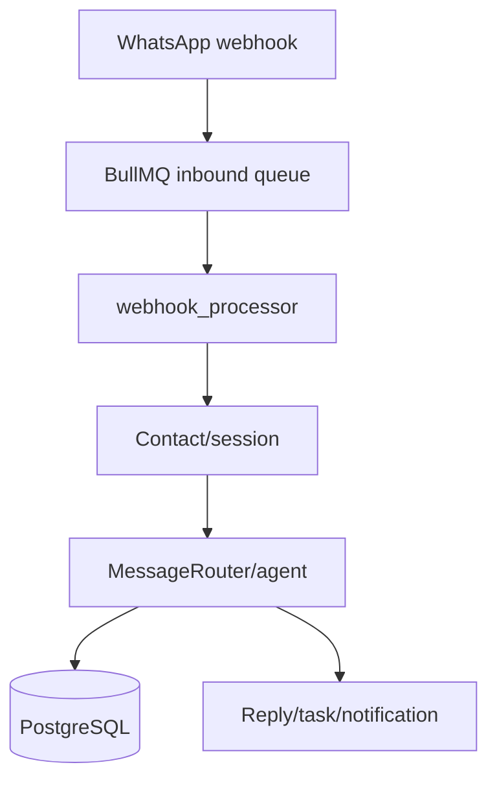
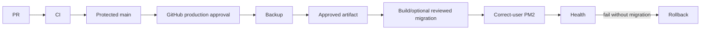

# Codebase Engineering Handover & Technical Audit

> **Status:** in progress — repository inventory, source review, Graphify reconciliation, and deployment reconstruction are underway.
> **Prepared:** 2026-09-16
> **Scope:** local repository evidence plus the supplied `handover/` documentation. Production is not modified by this audit.

## Evidence and confidence policy

Evidence is ranked as: repository source > runtime/deployment evidence > configuration > Git history > handover documentation > Graphify. Findings are labelled **CONFIRMED**, **HIGH-CONFIDENCE INFERENCE**, **REQUIRES PRODUCTION VERIFICATION**, or **UNKNOWN**. Secret values are deliberately excluded.

## Investigation log

- Confirmed the desktop exists, but this execution environment only permits writes inside the repository; this required deliverable is therefore maintained at this path.
- Existing working-tree changes are preserved. They include the supplied handover material, Graphify output, and other user-owned audit artifacts.
- Initial evidence sources identified: `handover/ENGINEERING-HANDOVER.md`, `docs/`, `agents/`, Git history, deployment scripts, Docker/PM2 configuration, and `graphify-out/graph.json`.

## 1. Executive Summary

**CONFIRMED:** Realty Pandit is a multi-surface real-estate CRM: public listings, internal CRM, partner/builder paths, portal lead intake, WhatsApp automation, voice, and an early Android call gateway share one Express/Prisma backend. Top takeover risks: server/Git drift, an untracked live bootstrap, secret-bearing tracked material, and red quality gates.

## 2. What This Application Does

It manages contacts, agents, partners, inventory, demand, deals, visits, tasks, workflows, sharing, campaigns, notifications, staff calls, and external leads. Public flows include listings, projects, AI chat, lead/visit forms and post-property.

## 3. Business Purpose

Lead-to-deal operations: capture interest, assign/qualify it, match property inventory, coordinate visits, and serve staff/partners. Evidence: `agents/backend/src/app.ts`, `routes/`, `services/`, and `prisma/schema.prisma`.

## 4. Technology Stack

| Area | Technology | Evidence |
|---|---|---|
| API/data | Node 20, Express 5, TypeScript, Prisma/PostgreSQL | `agents/backend/` |
| Async | Redis, BullMQ | `backend/src/queues/` |
| CRM | React 19, Vite 7, PWA | `agents/frontend/` |
| Public web | Next.js 16, React 19, Tailwind 4 | `agents/website/` |
| Voice/calls | FastAPI/Pipecat; Node WebSockets; Android Kotlin | `pipecat/`, `call-gateway/`, `android/` |

## 5. Source-of-Truth Assessment

Repository source outranks docs. Handover is runtime evidence last stated verified 2026-09-12 and needs VPS confirmation. `fix-dev` equals `main` at `b738ea8`; the remote default branch is older `feature/contact-system-refactor`: deployment must reconcile that first.

## 6. Repository Coverage Assessment

This assessment has two independent axes. **Catalog coverage** means every Git-tracked file has a row and a role explanation in [Appendix A — Complete File Coverage Catalog](CODEBASE_FILE_COVERAGE_APPENDIX.md). **Graphify representation** means Graphify extracted at least one navigable node whose `source_file` matches that file; it is useful for relationship tracing but cannot parse every file type.

| Metric | Count |
|---|---:|
| Git-tracked files | 3,027 |
| Catalogued in Appendix A | 3,027 (100%) |
| Files represented by Graphify | 1,566 |
| Not represented by Graphify | 1,461 |
| Backend routes/services | 37 / 115 |
| Prisma models/migrations | 66 / 46 |
| Backend test files | 48 |
| Website routes / CRM components | 46 / 111 |

The 1,410 / 1,617 values shown in the earlier screenshot were a pre-update Graphify snapshot. The current values above were calculated after `graphify update .` on 2026-09-16. A file that is not a Graphify node is still catalogued and manually classified; it is not excluded from the engineering audit. Cataloguing also does not prove every production configuration has been executed or verified live.

## 7. Graphify Coverage & Limitations

Graphify has 10,361 nodes and confirmed the `server.ts → scheduled_worker.ts` path plus core auth/service relationships. It is navigation only.

## 8. Files Missing From / Poorly Represented in Graphify

The 1,461 files without a matching Graphify node include migrations, configuration JSON, Compose, Android resources, many call-gateway files, environment examples, scripts, browser-QA artifacts and deployment docs. Their complete catalog entries are in Appendix A. Production `server-bootstrap.js` is absent from Git entirely.

## 9. Repository Structure

`agents/backend` API; `frontend` CRM; `website` public web; `pipecat` voice; `android` staff app; `call-gateway` handset bridge; `agents/deployment` legacy deployer; `docs`/`handover` runbooks; `deploy` guarded GitHub release tooling.

## 10. System Architecture

## 11. Architecture Diagram

nginx/TLS/PM2 shape comes from handover and is **REQUIRES PRODUCTION VERIFICATION**; the application relationships above are source-confirmed.

## 12. Component Responsibilities

`backend/src/app.ts` mounts middleware/routes; `server.ts` owns startup/workers; `prisma/schema.prisma` is the data contract; frontend is CRM; website is public entry; Pipecat serves voice; call gateway bridges handsets.

## 13. Application Entry Points

API: `backend/src/server.ts` (workers only PM2 instance 0). CRM: `frontend/src/main.tsx`. Website: `website/src/app/` plus `middleware.ts`. Voice: `pipecat/main.py`. Gateway: `call-gateway/src/server.ts`. Android: `AndroidManifest.xml`/`MainActivity`.

## 14. Request Lifecycle

## 15. Frontend Architecture

React/Vite SPA with auth/theme/toast contexts, PWA, API clients and lead/inventory/deal/team/analytics components. Build passes; lint has 918 errors.

## 16. Backend Architecture

`app.ts` uses Helmet, CORS, cookies, CSRF, compression, raw-body capture, limiters and error capture. `server.ts` is cluster-aware. `db.ts` has global Prisma extensions, so it has high blast radius.

## 17. API Architecture

Public: `/public`, `/user`, `/auth`, `/webhooks`, `/external`, selected callbacks, `/agent`, `/builder`. Staff: `/api`, `/inventory`, `/api/inventory`, deal/calendar/tasks/workflow/reports/marketing/notifications groups.

## 18. Database Architecture

66 Prisma models, 25 enums. Core: Tenant, Contact, Agent, Inventory, Transaction, Appointment, Task, PartnerAgent, Owner, Project, Lead, Interaction, WhatsAppMessage, StaffCall, IntegrationSync. Phone is a key cross-model identity.

## 19. Database ER Diagram

## 20. Authentication

Staff: cookie JWT (`routes/auth.ts`, `middleware/auth.ts`). Public: phone OTP. Partner/builder: separate JWT paths. Production cookie and CSRF scope are `.realtypandit.in` per source.

## 21. Authorization & Permissions

Role/permission middleware, `requireSuperBoss`, partner allow-lists and data scoping protect primary routes. Record ownership must remain a P1 route-by-route review.

## 22. Roles

Internal roles: `super_boss`, `manager`, `employee`; partner permissions default-deny. External agents, builders and public users use distinct token logic.

## 23. Feature Catalog

| Feature | Entry | Side effect |
|---|---|---|
| Contacts/leads | `/api/contacts`, `/api/leads` | Contact/Lead/tasks |
| Inventory | `/api/inventory`, `/inventory`, `/public/post-property` | media/matching |
| Deal pipeline | `/api/deals`, `/api/transactions` | visit/commission |
| Calendar/visits | `/api/calendar`, public booking | appointments/alerts |
| Public listings/chat | `/public/*` | cached reads/AI |
| Provider intake | `/webhooks/*`, `/external/*` | queue/contact upsert |

## 24. Major User Workflows

Public inquiry → Contact; chat → visit; portal lead → contact; inventory → match/share; lead → deal/visit/outcome; WhatsApp inbound → queue → agent/reply.

## 25. Internal Workflows

Team transfer/deactivation, bulk upload, Google sync, task escalation, reporting, campaign templates and ownership/commission flows exist; current tests do not prove all of them.

## 26. Workflow Diagrams

## 27. Business Logic

`backend/src/services/` holds classification, matching, transitions, scheduling, ownership, commission, partner creation, social, notification, LLM, WhatsApp and task rules.

## 28. State Machines

Transaction: `NEW → MATCHED → VISIT_SCHEDULED → VISITED → NEGOTIATION → CLOSED_WON|CLOSED_LOST`, with `ON_HOLD`. Staff calls: `UPLOADING → PROCESSING → TRANSCRIBED → READY_FOR_REVIEW → APPROVED|REJECTED`.

## 29. Background Jobs

`scheduled_worker.ts` registers 34 BullMQ schedules: reporting, QA, subscriptions, follow-up, call processing, portal polls, session keepalive, safety nets, reminders, Google sync, recycler and deal nudges.

## 30. Queues

`whatsapp-inbound`, `social-inbound`, `scheduled-jobs`; Redis is an operational control plane, not optional cache.

## 31. Scheduled Jobs / Cron

BullMQ is primary; legacy node-cron is fallback when worker startup fails. Handover's OS cron claims require live verification.

## 32. Data Pipelines

Ingress → validation → service → persistence → notification covers leads, webhooks, uploads and calls. Failure domains: provider verification, Redis, Gemini, DB, retries/dedup.

## 33. Business Pipelines

Assignment, matching, visits, follow-up, commission, partner ownership and campaign logic are multi-layer flows. Historical docs explain intent, not runtime proof.

## 34. API Pipelines

Cookie writes use CSRF; bearer callers bypass it; public/webhook exceptions exist. Provider authentication must be independently enforced.

## 35. External Integrations

Meta/WhatsApp/FB/IG (`webhooks.ts`, `facebook.ts`); Gemini (`llm.ts`); Google OAuth/Calendar/Maps; 99acres/MagicBricks/Housing; Razorpay; GlitchTip.

## 36. Webhooks

Meta signature verification is log-only until `META_SIGNATURE_ENFORCE=true`; Pipecat verifies WhatsApp callbacks. Omnidim documents missing signature validation: P1 until authenticated/disabled.

## 37. Storage

Local uploads plus memory-backed upload handlers. Preserve uploads in deploys; regression-test document/media authorization.

## 38. Cache

Redis supports cache, session, dedup and queues. Verify loopback/password and Redis-down behavior in production.

## 39. Configuration

Env examples are safe templates. `config/api_keys.json`, `config/env.json`, Compose and historical docs are secret-bearing tracked artifacts: rotate/remove/purge history without repeating their values.

## 40. Environment Variables

Groups: core (`NODE_ENV`, `PORT`, `DATABASE_URL`, `REDIS_*`); URLs/auth (`*_URL`, `*_JWT_SECRET`, `EXTERNAL_API_KEYS`); Meta/Google (`WHATSAPP_*`, `FB_*`, `IG_*`, `META_*`, `GOOGLE_*`, `GEMINI_API_KEY`); portals/payment; flags; GlitchTip/Sentry; call gateway. Source scan finds 93 names—inspect source before changes.

## 41. Development Environment

Node 20; `npm ci` per app; PostgreSQL and Redis required for integration-like backend checks. Never copy production values into source/logs.

## 42. Production Environment

**REQUIRES PRODUCTION VERIFICATION:** handover says nginx, loopback PostgreSQL/Redis, root PM2 backend/Pipecat and `realty` PM2 website/admin.

## 43. Current Hostinger Deployment

Live paths reportedly `/var/www/realty-pandit/{backend,frontend,website}` with SSH copy/build deployment. Untracked `server-bootstrap.js` prevents safe destructive sync.

## 44. GitHub → Hostinger Deployment Architecture

## 45. GitHub Actions CI/CD

Existing backend/website CI is incomplete. Added `deploy-hostinger.yml` adds backend/frontend/website checks and guarded deployment; it remains disabled until preflight and approval.

## 46. GitHub Secrets

Environment `production`: `HOSTINGER_HOST`, `HOSTINGER_PORT`, `HOSTINGER_USER`, `HOSTINGER_SSH_PRIVATE_KEY`, `HOSTINGER_KNOWN_HOSTS`, `HOSTINGER_DEPLOY_PATH`. Known hosts prevents host-key bypass.

## 47. Hostinger Server Configuration

Confirm PM2 users, nginx, backup/restore, firewall, live hashes, ownership, SSH fingerprint and migration state. Use a dedicated deploy key.

## 48. First-Time Deployment Setup

Read-only inventory → capture bootstrap hash → backup/restore test → protect main/CI/environment → configure secrets/known_hosts → manual artifact deploy/rollback → enable variable only after success.

## 49. Normal Deployment

Approved PR → `main` → passing quality gates → Environment approval → artifact release. New script preserves `.env`, uploads, logs, and bootstrap; no `--delete`.

## 50. Deployment Verification

Check `/health`, website `:3000`, admin nginx, both PM2 daemons, browser smoke, logs, migration state and queue failures.

## 51. Rollback

No migration: `github-hostinger-release.sh rollback <backup> <release-id> 0`, then rebuild/restart/verify. Database rollback is manual by design.

## 52. Production Runbook

Site/API down: nginx, both PM2 lists, local health. 500: backend errors, DB/Redis. Worker/cron: root PM2, Redis/BullMQ and OS cron. Disk/CPU: `df -h`, uploads/logs/backups, memory/PM2. SSL: nginx/certbot/DNS.

## 53. Logging

Backend Winston rotates JSON logs; Pipecat/PM2 logs are separate. `instrument.ts` scrubs selected sensitive values.

## 54. Monitoring & Observability

GlitchTip/Sentry, health, queue/circuit stats and structured logging exist. Alert routing/thresholds are unknown until production inspection.

## 55. Error Handling

Express errors and Sentry exist; queue retry helps selected jobs. Fire-and-forget notifications can fail silently without alerts.

## 56. Testing Architecture

Vitest/Supertest/Prisma mocks; lint/build scripts; call gateway Node test. Browser-QA artifacts are not a dependable gate.

## 57. Missing Tests

Add auth/ownership, webhook-negative, Redis-down, upload authorization, migration, deploy/rollback and provider contract tests.

## 58. Security Audit

| ID | Severity | Finding | Evidence | Fix |
|---|---|---|---|---|
| SEC-01 | Critical | tracked secret-bearing material | config/Compose/docs | rotate/remove/purge |
| SEC-02 | High | dependency advisories | npm audit | controlled upgrades |
| SEC-03 | High | Meta signature log-only | middleware/env | enforce after observation |
| SEC-04 | High | Omnidim no signature | route source | authenticate/disable |
| SEC-05 | High | memory rate limits under PM2 | rate_limit source | Redis store |

## 59. Security Vulnerabilities

`npm audit` found backend 28 issues (13 high), frontend 9 (one critical), website 18 (one critical), call gateway none. Highlights include Axios, Next.js, jsPDF, React Router and transitive dependencies. Do not run `npm audit fix --force` blindly.

## 60. Functional Problems

Backend: 381/395 tests pass; 14 fail (stale expectations, mocks missing newer Prisma methods, validation/menu/PDF mismatches, health test without Redis). These are real release-gate failures.

## 61. Workflow Problems

Remote default branch, live server source and `main` diverge. Legacy SSH copying has no immutable Git release. PWA invalidation is manual. Redis failure fallback needs a rehearsal.

## 62. Pipeline Problems

CRM lint: 918 errors; website lint: 252 errors; call-gateway `npm test` invokes TypeScript directly with Node and fails; frontend build warns of a ~770 kB gzip main chunk; Next warns that `middleware` is deprecated.

## 63. Architectural Problems

Large monolith, broad Prisma write extensions, legacy/new scheduler paths, untracked server artifact. Keep the monolith; first improve its tests and release evidence.

## 64. Database Problems

Production migration state, backup freshness and restore proof are unknown. `$queryRawUnsafe` call sites require focused review before accepting user-derived data.

## 65. Performance Problems

Demonstrated: frontend bundle warning and memory upload paths. High-probability: heavy reporting/media/AI. Future: uploads/logs/cache/failed queues growth.

## 66. Scalability Risks

Redis is shared control plane; memory rate limits do not coordinate PM2 instances; API owns expensive work. Measure before adding caches or service splits.

## 67. Dependency Problems

High/critical advisories and deprecated packages exist. Upgrade by component with tests/builds and compatibility review.

## 68. Technical Debt

Type/lint baseline, deploy scripts, scheduler duplication, server drift, generated QA artifacts tracked with source and historical sensitive docs are major debt clusters.

## 69. Dead / Legacy Code

Candidates—do not delete yet: root deploy scripts, generic Compose, legacy scheduler fallback, retired `/agent` paths, old PM2 config and deprecated Next middleware.

## 70. Configuration Problems

Secret-bearing tracked configuration and documentation are P0. Env sprawl needs a typed validation schema after rotation.

## 71. Deployment Risks

Direct root SSH, old scripts with weak host-key practice, server/Git drift, in-place builds and root/`realty` split make existing deployment fragile.

## 72. Production Risks

Verify backups, restore, nginx, PM2 boot, live revisions, queue errors, provider tokens, SSL renewal and migration state before calling ownership complete.

## 73. Master Issue Register

| Priority | Area | Problem |
|---|---|---|
| P0 | Secrets | tracked/historical credential material |
| P0 | Deployment | live/Git drift plus untracked bootstrap |
| P1 | Security | webhooks, limits, dependencies |
| P1 | Quality | red test/lint/audit gates |
| P2 | Operations | backup/restore unknown |
| P2 | Performance | bundle/media growth |

## 74. P0 Issues

Rotate potentially exposed credentials; remove and purge sensitive material. Capture/reconcile the live bootstrap and all live file hashes before GitHub cutover.

## 75. P1 Fixes

Enforce Meta signatures after observation; protect Omnidim; use Redis rate limiting; update dependencies; repair CI/test/lint baseline.

## 76. P2 Fixes

Restore-test database backups, inventory production, harden uploads/alerts, audit object authorization, measure performance.

## 77. P3/P4 Fixes

Remove confirmed dead artifacts, raise type coverage, and modularize only when measured churn justifies it.

## 78. Detailed Fix Plan

Phase A: access/rotation/server inventory/backup. Phase B: green quality and dependency gates. Phase C: manual artifact deploy plus rollback. Phase D: protected automatic delivery. Phase E: webhook/authorization/reliability hardening.

## 79. Risk of Each Fix

Rotation can break integrations; dependency upgrades can regress runtime; migrations can be irreversible; PM2 ownership changes can cause outages. All need backup, test and rollback.

## 80. Testing Strategy Fixes

Make backend tests deterministic with PostgreSQL/Redis; repair mocks; ratchet lint; add provider-negative/auth-matrix/migration/deploy rollback tests. Never mask release gates with `continue-on-error`.

## 81. Deployment Strategy Fixes

Use the added guarded workflow after preflight. It preserves persistent data and prohibits automatic migrations. Migration workflows require explicit review and backup.

## 82. Estimated Engineering Timeline

Assumes experienced engineer, access and provider cooperation.

## 83. One-Engineer Timeline

| Workstream | Likely |
|---|---:|
| Production/secret safety inventory | 4 days |
| CI, tests, lint, dependencies | 10 days |
| GitHub deployment adoption | 4 days |
| Security/reliability | 8–15 days |

## 84. Multi-Engineer Opportunities

One owns deployment/security, another quality/dependencies, a third workflow/UI validation. Secret rotation, migrations and cutover remain sequential.

## 85. Critical Path

Rotation → server inventory/restore proof → green gates → manual deploy/rollback → protected automatic release.

## 86. Developer Learning Path

Read handover, `docs/PROJECT_STATUS.md`, backend `server.ts`, `app.ts`, `db.ts`, schema, auth, worker, public/deal/inventory routes, then frontend/website API clients.

## 87. Files I Should Read First

`handover/ENGINEERING-HANDOVER.md`; `docs/PROJECT_STATUS.md`; `backend/src/{server,app,db}.ts`; `prisma/schema.prisma`; `middleware/auth.ts`; `queues/workers/scheduled_worker.ts`; `routes/{public,deals,inventory,webhooks}.ts`; frontend `App.tsx`; website `src/app/`.

## 88. How Debug Application

Start logs → route/middleware → service → Prisma → queue/provider. Reproduce with non-production data; do not use live users/tokens as fixtures.

## 89. Production Diagnostics

Read-only: `hostname; whoami; pm2 list; sudo -u realty -H pm2 list; systemctl --no-pager status nginx postgresql redis-server; df -h; free -m; curl -fsS http://127.0.0.1:7071/health`.

## 90. Common Failure Scenarios

Redis down affects queues/session/dedup; Prisma mismatch needs migration/client investigation; stale CRM is PWA/build; stale website can be wrong PM2 user; provider HTTP acceptance is not delivery confirmation.

## 91. Questions for Previous Engineers

Exact `server-bootstrap.js` source/hash? Live revision per component? Last restore drill? Which values have been rotated? Is Meta signature enforcement live? Which server configs intentionally stay outside Git?

## 92. Unknowns & Verification Required

Live PM2/nginx/firewall/Cloudflare/secrets/migrations/backups/queues/provider configuration/ownership all need read-only server verification.

## 93. Recommended Future Architecture

Keep the monolith; make it a tested modular monolith with versioned server manifest, typed config, authenticated integrations, deterministic jobs, artifacts and restore proof.

## 94. Short-Term Roadmap

P0 rotation/reconciliation, inventory, gates, deploy rehearsal and protected GitHub delivery.

## 95. Medium-Term Roadmap

Webhook/limit hardening, authorization audit, alerts, retention, performance baseline and smoke coverage.

## 96. Long-Term Roadmap

Staging, versioned infrastructure, hardened deploy user, secret lifecycle, repository cleanup, measured module boundaries.

## 97. Top 10 Immediate Actions

1. Rotate/remove exposed material.
2. Reconcile default branch to `main`.
3. Hash live bootstrap/config read-only.
4. Restore-test DB backup.
5. Patch critical/high dependencies.
6. Repair 14 backend failures and add Redis CI.
7. Make frontend/website lint green.
8. Fix call-gateway test runner.
9. Enforce signed webhooks.
10. Rehearse artifact deploy/rollback before enabling automatic delivery.

## 98. Final Engineering Assessment

Ownership confidence is **MEDIUM**: architecture is mapped, but production drift, secret exposure, red gates and unverified VPS state preclude a claim of complete takeover.

## 99. Repository ↔ Graphify Discrepancies

Graphify found core code paths but omitted operational artifacts quantified in section 6. Manual source review found secret-bearing config/docs and the production-only bootstrap mismatch; source/runtime evidence overrides graph conclusions.

## 100. Deployment Preconditions Checklist

- [ ] Rotate/remove/purge secrets
- [ ] Reconcile bootstrap/live source
- [ ] Restore-test backup
- [ ] Protect main and require green CI
- [ ] Configure GitHub Environment reviewers/known_hosts
- [ ] Rehearse deploy and rollback
- [ ] Enable deployment variable only after review

## 101. Final Verification

This master document is intentionally in the repository because the execution sandbox cannot write to the Desktop. It contains architecture, coverage, workflows, security audit, deployment/runbook, issue register, timeline and source references without secret values.
