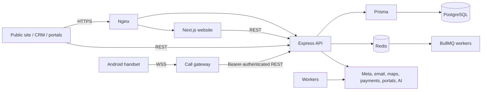
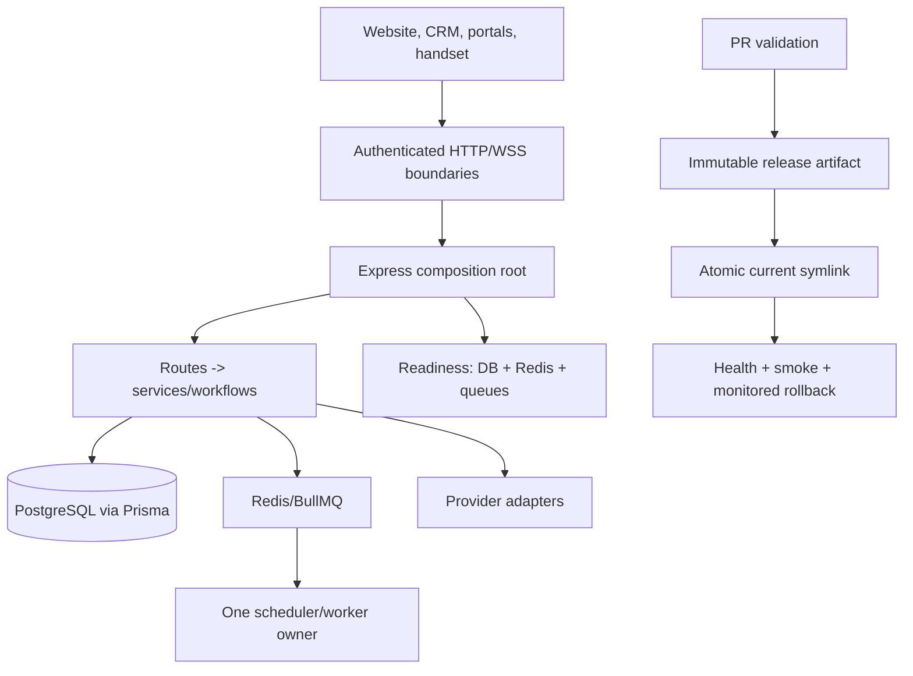

# Engineering audit — 2026-09-22

## Scope and evidence

This is an implementation audit of the checked-out repository on `main`. It does not assert anything about live services, data, credentials, provider accounts, backups, DNS, or deployment state. Those systems were deliberately not accessed or changed.

Evidence collected during this audit:

| Check | Result |
| --- | --- |
| Backend unit/integration suite | 49 files, 401 tests passed |
| Call-gateway protocol simulation | 32 checks passed |
| CRM lint | 0 errors, 892 warnings across 106 files |
| Website lint | 0 errors, 307 warnings across 69 files |
| CRM production build | Passed; largest initial chunk is 2.55 MB / 685 KB gzip |
| Website webpack production build | Passed after the font dependency removal |
| Production npm audits | Backend, CRM, and website: 0 vulnerabilities at high/critical threshold |
| Backend TypeScript | 391 errors in 49 files; not a passing gate |
| Compose configuration | Passed with a supplied local-only password |
| Workflow syntax | All six workflow YAML files parse |
| Secret scanning and action supply chain | Pinned Gitleaks, checkout, and setup-node actions added/updated; all workflow YAML parses; GitHub-hosted execution is pending |

The default Next/Turbopack build could not run in this environment because its helper process cannot bind a local port. The webpack production build validates the same application after removing its font-download dependency. CI remains the authority for the default build on a normal Linux runner.

## Repository map and architecture

| Area | Responsibility | Primary entry points |
| --- | --- | --- |
| `agents/backend` | Shared API, authorization, workflows, integrations, queues | `src/server.ts`, `src/app.ts`, Prisma schema |
| `agents/frontend` | Internal staff CRM/PWA | `src/App.tsx`, `src/api/client.ts` |
| `agents/website` | Public marketplace and agent/builder surfaces | `src/app`, `src/lib/api.ts`, `src/proxy.ts` |
| `agents/call-gateway` | Android handset WebSocket and internal call-control API | `src/server.ts` |
| `agents/pipecat` | Voice automation service | Python service and requirements |
| `agents/android` | Staff Android application | Gradle project |
| `.github/workflows`, `deploy` | Validation, immutable release, rollback procedure | CI workflows, `github-hostinger-release.sh` |

The intended design is an appropriately simple modular monolith: the backend is the authority for tenant, role, workflow, inventory, and deal rules. Redis is an operational dependency for queues, scheduled work, deduplication, and sessions; PostgreSQL is the durable system of record.

## Critical dependency analysis

| Component | Evidence | Consumers / risk | Assessment |
| --- | --- | --- | --- |
| Express composition root | `agents/backend/src/app.ts` (468 lines, 63 route mounts) | Every browser/API request; security middleware order and route mounting are coupled here | High-impact hotspot; retain as the composition root, but keep new business logic out of it |
| Process lifecycle | `agents/backend/src/server.ts:31-223` | PM2 cluster, workers, graceful shutdown | Correctly restricts workers to instance 0; fallback scheduling deserves production-only verification |
| Scheduler | `queues/workers/scheduled_worker.ts` (1,174 lines, 30+ registrations) | Recurring operational actions and provider sends | Largest backend hotspot; a registry refactor is desirable only after characterization tests for each job |
| Database contract | `prisma/schema.prisma` (60+ models/enums) | All core workflows | Prisma/PostgreSQL is a sound fit; migration state and restore evidence require non-repository verification |
| CRM API client | `frontend/src/api/client.ts` (1,483 lines) | Internal UI contracts | Broad client contract surface; retain as one client but split by domain only when changing a domain |
| Website API client | `website/src/lib/api.ts` (982 lines) | Public, agent, and builder UI contracts | Similar hotspot; no speculative rewrite performed |
| Call gateway | `call-gateway/src/server.ts` | Real handset calls | Previously had known token defaults and an unauthenticated replacement path; hardened and covered by simulation |

No dependency cycle was confirmed from the scoped graph and source review. Graphify identifies `app.ts` as the highest-degree code node (133 relationships), which agrees with the route-mount inventory.

## Initial ratings — permanent baseline

These ratings describe the repository before this audit's implementation work. Scores are relative to a small-team modular monolith, not an enterprise-platform ideal. Confidence is moderate unless stated otherwise.

| Parameter | Initial /10 | Evidence and rationale |
| --- | ---: | --- |
| Overall architecture | 6 | Sensible modular-monolith core; composition and scheduler hotspots are large |
| Code quality | 5 | Strong targeted tests, but 391 backend type errors and extensive lint warnings |
| Code organization | 5 | Clear top-level services/routes/workflows; several clients and workers are oversized |
| Maintainability | 5 | Useful docs and tests, but typecheck debt and sprawling API clients slow safe change |
| Modularity and separation of concerns | 5 | Backend owns most rules; app/scheduler/client modules have mixed breadth |
| Security | 5 | Auth, CSRF, Helmet, RBAC, signatures, and rate limits exist; exposed credentials and gateway defaults were material gaps |
| Reliability and error handling | 5 | Queues, retries, Sentry, and shutdown exist; health could misreport Redis availability |
| Scalability | 6 | PM2 clustering, PostgreSQL, Redis, BullMQ; no measured capacity targets |
| Performance | 6 | Standard stack; CRM bundle warning and no representative load evidence |
| Database architecture | 6 | Prisma/PostgreSQL with a rich schema; migrations and restore proof unverified |
| Automated testing | 5 | 49 backend test files, but gateway command did not run and website/CRM lack comparable journey tests |
| CI/CD maturity | 6 | Locked installs, service-backed backend tests, audits, immutable-release workflow; incomplete PR coverage and non-blocking typecheck |
| Deployment safety | 7 | Protected environment, artifact release, health verification, rollback guard, manual migration control |
| Observability | 6 | Structured logging, Sentry/GlitchTip, health and queue stats; website instrumentation used deprecated conventions |
| Developer experience | 4 | Useful scripts, but broken gateway test command, tracked development secret, and typecheck debt |
| Operational simplicity | 6 | Appropriate small-service footprint; old deployment material remains a confusion risk |
| Cost efficiency | 7 | Single PostgreSQL/Redis modular monolith; no unnecessary distributed infrastructure |
| Production readiness | 5 | Strong foundations but source-secret remediation, typecheck debt, and live operational proof remained |

**Overall Architecture: 6/10**

**Codebase Quality and Maintainability: 5/10**

**Production Deployment Pipeline: 6/10**

## Findings and disposition

| Finding | Evidence | Severity | Impact | Disposition / verification |
| --- | --- | --- | --- | --- |
| Plaintext privileged credentials were tracked | Compose file and three admin scripts | Critical | Repository/history disclosure can enable unauthorized access | Source defaults removed; local Compose requires an untracked value; privileged scripts require `ADMIN_PASSWORD`. Credential rotation and history remediation remain operational work. |
| Gateway accepted predictable token defaults and could be evicted before handshake | `call-gateway/src/server.ts` | High | Remote call-control compromise or handset denial of service | Fixed. 32-check protocol simulation covers missing config, oversized body, and hostile handshake behavior. |
| Backend health claimed Redis was connected regardless of result | `app.ts` Redis predicate | High | Deploy/load balancer could report healthy while queues/sessions are unavailable | Fixed. Added degradation test; backend suite passes. |
| Gateway test command could not execute TypeScript and was absent from CI | `call-gateway/package.json`, workflows | High | Call safety regressions could ship unchecked | Fixed with native Node 22 type stripping, explicit engine floor, environment example, and CI workflow. |
| CI used Node 20–based GitHub actions | Workflow action references | Medium | GitHub-hosted workflows can fail after Node 20 action-runtime removal | Fixed with official Node 24-compatible, immutable checkout/setup-node action revisions. Hosted execution remains required. |
| Website compilation depended on external font download | `website/src/app/layout.tsx` | Medium | Build fails in constrained or offline build runners | Replaced with system stack; webpack production build passes. |
| Next 16 conventions were deprecated, weakening observability confidence | Website middleware/Sentry build warnings | Medium | Future framework upgrade risk; server/edge Sentry setup warnings | Migrated to `proxy.ts`, instrumentation files, and non-deprecated Sentry config import. |
| Backend typecheck is non-blocking and currently fails | `backend-ci.yml`; 391 `tsc` errors in 49 files | High | Static contract regressions can bypass CI | Intentionally left visible. Fix in domain-sized batches, starting with `routes/team.ts` and `routes/inventory.ts`; do not mask or disable it. |
| Client lint debt | 892 CRM and 307 website warnings | Medium | Signal-to-noise in reviews and future errors | Warnings do not fail CI. Reduce by touched file, not with blanket suppression. |
| CRM initial bundle is large | CRM production build | Medium | Slower first load on mobile networks | Measure route-level usage before code splitting; no speculative chunking added. |
| Live deployment and recovery proof is unavailable here | Deployment runbook and workflow only | High operational gap | No source check can prove server ownership, backup restore, PM2 stability, provider delivery, or rollback | Must be completed in an approved maintenance window. |

## Target architecture

Keep the modular monolith. The practical target is clearer execution ownership and hard boundaries, not more services.

Retain the backend as policy authority, Prisma/PostgreSQL, Redis/BullMQ, and artifact-based deployment. Refactor only hotspots that are actively changing: scheduler job registration/dispatch, then the relevant API client domain. Do not introduce microservices, another datastore, cache layer, or broker.

## Before-and-after scorecard

The after scores reflect only implemented, verified repository changes; they do not claim live production verification.

| Parameter | Before /10 | After /10 | Evidence of improvement |
| --- | ---: | ---: | --- |
| Overall architecture | 6 | 6 | Kept the appropriate modular monolith |
| Code quality | 5 | 6 | Removed unsafe defaults and made gateway tests executable |
| Code organization | 5 | 5 | No risky broad reorganization |
| Maintainability | 5 | 6 | Clear env contracts, test runner, operational guide |
| Modularity and separation of concerns | 5 | 5 | No unsupported claims |
| Security | 5 | 6 | Removed source defaults, hardened WS admission, constrained Compose secret handling |
| Reliability and error handling | 5 | 6 | Redis readiness is now honest; oversized gateway bodies rejected |
| Scalability | 6 | 6 | No capacity evidence added |
| Performance | 6 | 6 | Bundle warning remains; no measured change |
| Database architecture | 6 | 6 | Credential handling improved, but no schema/restore verification |
| Automated testing | 5 | 6 | Gateway simulation now runs and is in CI; backend health regression added |
| CI/CD maturity | 6 | 7 | Frontend, gateway, and pinned secret-scan PR checks; Node 24-compatible action revisions, least privilege and time bounds |
| Deployment safety | 7 | 7 | Existing guarded release flow preserved |
| Observability | 6 | 7 | Current Next instrumentation conventions and accurate readiness reporting |
| Developer experience | 4 | 6 | Runnable gateway tests, Compose sample, operational guide |
| Operational simplicity | 6 | 6 | No new infrastructure |
| Cost efficiency | 7 | 7 | No added recurring services |
| Production readiness | 5 | 6 | Material repository gaps closed; live proof/type debt remain |

**Overall Architecture: Before 6/10 → After 6/10**

**Codebase Quality and Maintainability: Before 5/10 → After 6/10**

**Production Deployment Pipeline: Before 6/10 → After 7/10**

## Five highest-leverage improvements

1. Remove and rotate exposed credentials. Leaving them permits account/database compromise; the smallest safe source fix is environment-only configuration plus an operational rotation.
2. Finish backend typecheck remediation in domain batches. Leaving 391 errors removes a key regression signal; start at the files with the most errors and require the gate only after the baseline is clean.
3. Complete the guarded deployment preflight, backup restore, rollback rehearsal, and smoke test. Repository tooling cannot prove live recoverability.
4. Keep the gateway CI simulation. It protects a physical-world safety invariant with one inexpensive deterministic check.
5. Profile the CRM before splitting its large initial bundle. Only add route-level lazy loading where the profiler and user journeys justify it.

## Production readiness assessment

**Classification: Partially production-ready with identified blockers.**

Repository-level security, reliability, build reproducibility, and CI coverage improved materially. The remaining blockers are: credential rotation/history remediation, first GitHub-hosted secret-scan execution, 391 backend TypeScript errors, live backup/restore and rollback proof, live PM2/nginx/Redis/queue verification, provider delivery checks, and critical browser journeys against a non-production environment. See [engineering-progress.md](engineering-progress.md) and [functionality-verification.md](functionality-verification.md) for the current evidence.

An independent read-only review found no Critical or High regression in the changed gateway, Redis readiness, Next migration, environment, or CI paths. It confirmed that real Redis-down, proxy/Sentry, hosted secret-scan, provider, and live deployment checks still need their stated environments.
